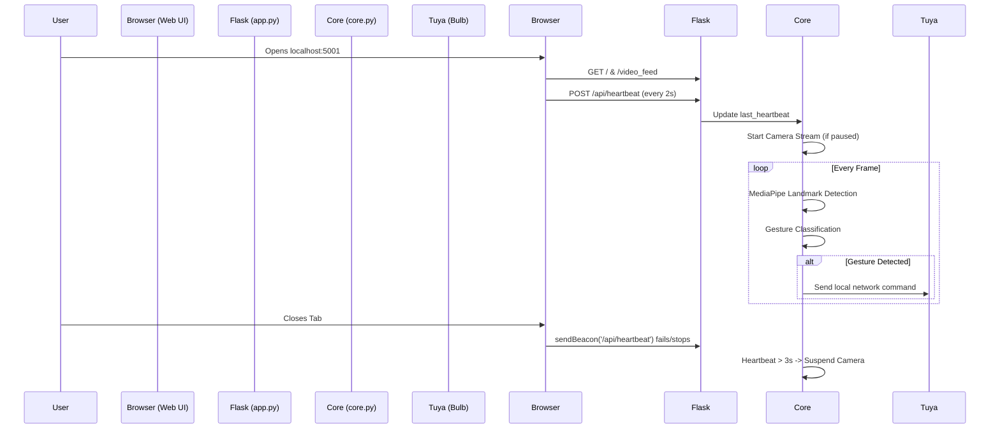

# 💡 AirLight — AI Gesture-Controlled Smart Lighting

> Control your Wi-Fi smart bulb with nothing but hand gestures and a stunning Web UI.

AirLight is a modern, headless AI application that uses your computer's webcam to recognize hand gestures in real-time and control Tuya-based Wi-Fi Smart RGB Bulbs. It features a sleek, interactive React-inspired Web Dashboard with real-time WebSocket-like polling, Dark/Light modes, and a stunning Glassmorphism aesthetic.

---

## 🎯 PRD (Product Requirements Document)

### **Vision**
To create a frictionless, futuristic, and highly aesthetic smart-home experience where users can control ambient lighting without touching a physical switch or phone.

### **Core Features**
1. **Touchless Control**: Turn lights on/off, change colors, adjust brightness, and trigger scenes using AI hand tracking.
2. **Beautiful Web Dashboard**: A centralized control center accessible via browser (`http://localhost:5001`) to manually override or monitor the AI.
3. **Smart Camera Lifecycle**: The webcam should only be active when the user has the Dashboard open. If the browser tab is closed, the camera instantly sleeps to save battery.
4. **Local Tuya Integration**: Instantaneous response times via local network packets (no cloud latency).

### **Target Audience**
Tech enthusiasts, smart-home hobbyists, and developers looking for a futuristic AI ambient lighting controller.

---

## 🛠️ TRD (Technical Requirements Document)

### **Technology Stack**
- **AI Core**: Python 3.9+, OpenCV (Video Capture), MediaPipe Tasks API (Hand Landmarker).
- **Backend**: Flask (Web Server), Threading (Concurrency), TinyTuya (Hardware API).
- **Frontend**: HTML5, Vanilla JS, TailwindCSS (Styling), iro.js (Color Wheel).
- **State Management**: Headless `core.py` worker acting as the single source of truth, updating `status` dictionaries parsed by the frontend via polling.

### **Performance Requirements**
- **Latency**: Gesture to physical bulb state change must occur in < 400ms.
- **FPS**: Webcam processing must sustain at least 24 FPS.
- **CPU Optimization**: Sleep loops must be utilized (`time.sleep(0.01)`) to ensure the Python background daemon doesn't max out CPU cores.

---

## 🔄 App Flow



---

## 🎨 UI/UX Brief

- **Aesthetic**: "Cyber-Tech" Glassmorphism. Dark backgrounds (`#0F0F10`), frosted glass panels (`rgba(43, 43, 46, 0.4)`), and vibrant accent colors.
- **Navigation**: Left-fixed sidebar with 6 distinct tabs (Dashboard, Devices, Gestures, Scenes, Analytics, Settings).
- **Interactivity**: 
  - Dynamic Color Wheel (`iro.js`) for 16M color selection.
  - Smooth HTML5 range sliders for Brightness and Density (Saturation).
  - Explicit UI buttons (TURN ON / TURN OFF) with hover micro-animations.
- **Theme**: Seamless Light/Dark mode toggling via Tailwind's `class` strategy.

---

## 🗄️ Backend Schema (State Management)

The central state of the application is maintained in `core.py` and served via `/status` to the frontend as JSON:

```json
{
  "gesture": "Swipe Up",       // String: Current active gesture
  "brightness": 85,            // Int: 1-100 percentage
  "saturation": 100,           // Float: 0.0-100.0 percentage
  "color": "custom",           // String: Name or "custom"
  "power": "ON",               // String: "ON" or "OFF"
  "fps": "29",                 // String: Current camera FPS
  "ip": "192.168.1.100",       // String: Bulb IP Address
  "bulb": "1/1 Online"         // String: Connection status
}
```

---

## 🚀 Implementation Plan (Completed)

- [x] **Phase 1**: Base OpenCV & MediaPipe implementation.
- [x] **Phase 2**: Hardware Integration (`tinytuya` local mapping).
- [x] **Phase 3**: Decoupling to a headless `core.py` and Flask Web Server.
- [x] **Phase 4**: Web UI Lifecycle (Heartbeat to shut off camera on tab close).
- [x] **Phase 5**: UI Overhaul (Glassmorphism, iro.js Color Wheel, Dark Mode).
- [x] **Phase 6**: Gesture Engine Optimization (Removed Dial, added Swipes & Peace/OK signs).

---

## ✨ Gesture Controls

| Emoji | Gesture | Action |
|-------|---------|--------|
| 🖐️ | Open Palm | Turn bulb **ON** |
| ✊ | Closed Fist | Turn bulb **OFF** |
| 👆 | Swipe Up/Down | Adjust **Brightness** (± 15%) |
| 🤏 | Pinch | Adjust **Density / Saturation** |
| ☝️ | 1 Finger | Set Color: **White** |
| ✌️ | 2 Fingers / Peace Sign | Set Color: **Red** |
| 🤟 | 3 Fingers | Set Color: **Green** |
| 🖐 | 4 Fingers | Set Color: **Blue** |
| 👌 | OK Sign | Set Scene: **Leisure** |
| 👉 | Swipe Right | Cycle to **next color** |
| 👈 | Swipe Left | Cycle to **previous color** |

---

## 🚀 Installation & Setup

1. **Clone & Install**
```bash
git clone https://github.com/yourusername/AirLight.git
cd AirLight
python3 -m venv venv
source venv/bin/activate
pip install -r requirements.txt
```

2. **Configure Tuya Credentials**
Update `config.json` with your bulb's Local IP, Device ID, and Local Key.
Set `"mock_mode": false`.

3. **Run the Server**
```bash
python3 main.py
```

4. **Open the Dashboard**
Navigate to `http://localhost:5001` in your browser!

---
*Built with ❤️ using MediaPipe, Flask, and TinyTuya.*
