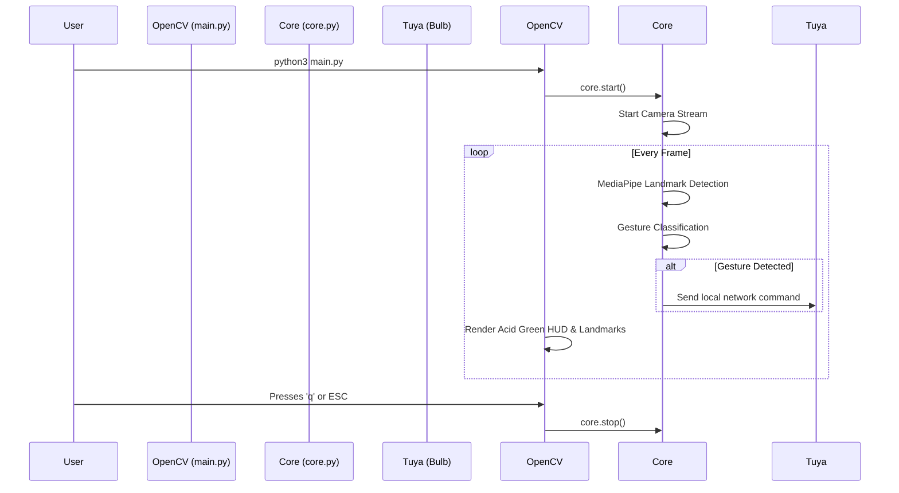

# 💡 AirLight — AI Gesture-Controlled Smart Lighting

> Control your Wi-Fi smart bulb with nothing but hand gestures and a sleek, modern Native HUD.

AirLight is a modern, headless AI application that uses your computer's webcam to recognize hand gestures in real-time and control Tuya-based Wi-Fi Smart RGB Bulbs. It features a blazing-fast native OpenCV Heads-Up Display (HUD) with a minimalist Gen-Z Tech aesthetic (Acid Green & Dark Gray), running purely locally without a browser.

---

## 🎯 PRD (Product Requirements Document)

### **Vision**
To create a frictionless, futuristic, and highly aesthetic smart-home experience where users can control ambient lighting without touching a physical switch or phone.

### **Core Features**
1. **Touchless Control**: Turn lights on/off, change colors, adjust brightness, and trigger scenes using AI hand tracking.
2. **Gen-Z Tech Native HUD**: A high-contrast, minimalist heads-up display drawn directly over the camera feed, featuring custom targeting brackets and skeletal tracking.
3. **Local Tuya Integration**: Instantaneous response times via local network packets (no cloud latency).
4. **Low Resource Footprint**: Built purely in Python with optimized loops—no heavy Electron wrappers or browser tabs required.

### **Target Audience**
Tech enthusiasts, smart-home hobbyists, and developers looking for a futuristic AI ambient lighting controller with a clean terminal-hacker aesthetic.

---

## 🛠️ TRD (Technical Requirements Document)

### **Technology Stack**
- **AI Core**: Python 3.9+, OpenCV (Video Capture & UI Rendering), MediaPipe Tasks API (Hand Landmarker).
- **Backend/Controller**: Threading (Concurrency), TinyTuya (Hardware API).
- **State Management**: Headless `core.py` worker acting as the single source of truth, updating `status` dictionaries parsed by the native HUD.

### **Performance Requirements**
- **Latency**: Gesture to physical bulb state change must occur in < 400ms.
- **FPS**: Webcam processing must sustain at least 24 FPS.
- **CPU Optimization**: Sleep loops must be utilized (`time.sleep(0.01)`) to ensure the Python background daemon doesn't max out CPU cores.

---

## 🔄 App Flow



---

## 🎨 UI/UX Brief

- **Aesthetic**: "Gen-Z Tech" OS. Solid dark backgrounds (`#0F0F0F`), sharp corners, geometric typography (`FONT_HERSHEY_DUPLEX`), and clean data alignment.
- **Color Palette**: 
  - Primary Accent: **Acid Green** (`BGR 0, 255, 100`) for data values, targets, and borders.
  - Text/Joints: **Pure White** (`BGR 245, 245, 245`) for maximum contrast and readability.
- **Interactivity**: 
  - Real-time hand skeletal tracking with custom brackets instead of basic dots.
  - Live hardware status readouts painted natively via OpenCV.

---

## 🗄️ Backend Schema (State Management)

The central state of the application is maintained in `core.py` and accessed by the native HUD:

```json
{
  "gesture": "Swipe Up",       // String: Current active gesture
  "brightness": 85,            // Int: 1-100 percentage
  "saturation": 100,           // Float: 0.0-100.0 percentage
  "color": "custom",           // String: Name or "custom"
  "power": "ON",               // String: "ON" or "OFF"
  "fps": "29",                 // String: Current camera FPS
  "ip": "192.168.1.100",       // String: Bulb IP Address
  "bulb": "1/1 Online"         // String: Connection status
}
```

---

## 🚀 Implementation Plan (Completed)

- [x] **Phase 1**: Base OpenCV & MediaPipe implementation.
- [x] **Phase 2**: Hardware Integration (`tinytuya` local mapping).
- [x] **Phase 3**: Decoupling to a headless `core.py` and modular components.
- [x] **Phase 4**: Migration to a purely Native Python OpenCV App.
- [x] **Phase 5**: UI Overhaul (Acid Green Gen-Z Tech HUD overlay).
- [x] **Phase 6**: Gesture Engine Optimization (Color toggling via fingers, swipe controls).

---

## ✨ Gesture Controls

| Emoji | Gesture | Action |
|-------|---------|--------|
| 🖐️ | Open Palm | Turn bulb **ON** |
| ✊ | Closed Fist | Turn bulb **OFF** |
| 👆 | Swipe Up/Down | Adjust **Brightness** (± 15%) |
| 🤏 | Pinch | Adjust **Density / Saturation** |
| ☝️ | 1 Finger | Set Color: **White** |
| ✌️ | 2 Fingers / Peace Sign | Set Color: **Red** |
| 🤟 | 3 Fingers | Set Color: **Green** |
| 🖐 | 4 Fingers | Set Color: **Blue** |
| 👌 | OK Sign | Set Scene: **Leisure** |
| 👉 | Swipe Right | Cycle to **next color** |
| 👈 | Swipe Left | Cycle to **previous color** |

---

## 🚀 Installation & Setup

1. **Clone & Install**
```bash
git clone https://github.com/yourusername/AirLight.git
cd AirLight
python3 -m venv venv
source venv/bin/activate
pip install -r requirements.txt
```

2. **Configure Tuya Credentials**
Update `config.json` with your bulb's Local IP, Device ID, and Local Key.
Set `"mock_mode": false`.

3. **Run the Application**
```bash
python3 main.py
```

The native OpenCV Heads-Up Display will instantly launch. Press `q` or `ESC` to quit the application.

---
*Built with ❤️ using MediaPipe and TinyTuya.*
